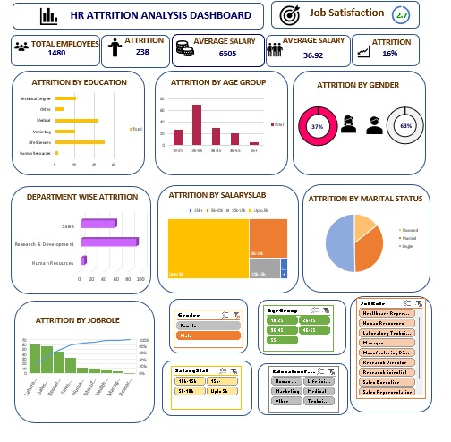

# 📊 Excel HR Attrition Analysis Dashboard  

This project analyzes **employee attrition data** using Excel and presents insights through an interactive dashboard.  

---

## 🔑 Key Insights  
- **Total Employees:** 1,480  
- **Attrition Rate:** 16%  
- **Detailed Breakdown:**  
  - By Education, Age Group, Gender, Department, Job Role, Marital Status, and Salary Slab.  

---

## 📂 Files Included  
- **HR_Attrition_CleanData.xlsx** → Dataset used for analysis  
- **Employee attrition.jpg** → Final dashboard (visual representation)  
- **README.md** → Project documentation  

---

## 🛠 Tools Used  
- Microsoft **Excel** (Pivot Tables, Charts, Dashboarding, Data Analysis)  

---

## 📸 Dashboard Preview  

---

## 🚀 How to Use  
1. Download the dataset (`HR_Attrition_CleanData.xlsx`).  
2. Open in Excel to explore pivot tables and calculations.  
3. View the dashboard (`Employee attrition.jpg`) for summarized insights.  

---

## ✅ Project Highlights  
✔ Real-world HR dataset cleaned & analyzed  
✔ Interactive dashboard for attrition insights  
✔ Business-ready insights on employee retention  

---

💡 *This project demonstrates skills in Excel dashboarding, data cleaning, and HR analytics.*
